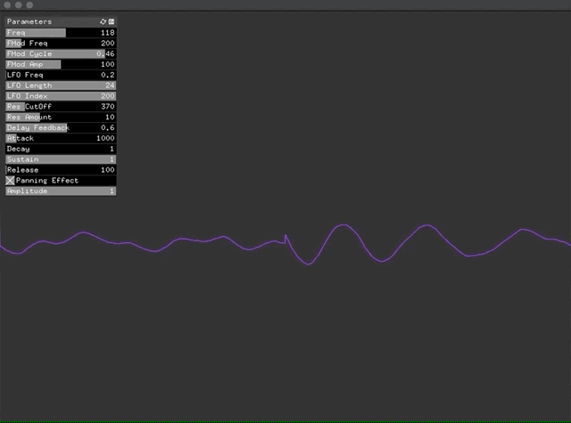

# Subtractive-Synthesis
An openFrameworks application demonstrating subtractive synthesis.

**Video:** https://vimeo.com/437126382

**Prerequisites:** openFrameworks, ofxMaxim, ofxGui

**Step 1:** Download [openFrameworks](https://openframeworks.cc/download/) and follow the setup guide for your OS and IDE.

**Step 2:** Download or clone the library [ofxMaxim](https://github.com/micknoise/Maximilian) into the openFrameworks/addons directory

**Step 3:** Create a new project using the projectGenerator, which is located in the directory openFrameworks/projectGenerator. Then using the addons button, add ofxGui and ofxMaxim to the project.

**Step 4:** Open the project in your IDE then from inside your IDE delete all the files inside the src directory.

**Step 5:** Download or clone this repo then copy the files inside the src directory of this repo into the src directory of the project you created.

**Step 6:** Compile the project.
